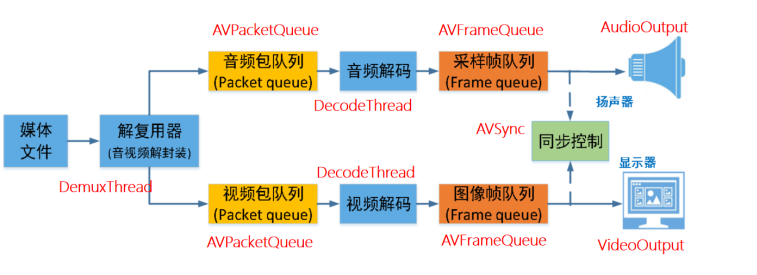

### SparkPlayer的2.0版本
### 整体架构
这个`FFmpeg`播放器采用`多线程架构`，将媒体处理流程分为`解复用`、`解码`和`渲染`三个主要阶段，通过`队列机制`实现各阶段的`解耦`和`异步`处理。

### 主要组件
1. `Main`函数（主控制）
- 负责初始化和协调各个模块
- 创建和管理其他组件的生命周期
- 处理整体程序流程控制
2. `DemuxThread`（解复用线程）
- 继承自`Thread`基类
- 负责**打开媒体文件，分离音视频流**
- 将分离的音视频数据包放入相应的`AVPacketQueue`
3. `DecodeThread`（解码线程）
- 继承自`Thread`基类
- 从`AVPacketQueue`获取**压缩数据包**
- 将**压缩**数据解码为**原始**音视频帧
- 将解码后的帧放入`AVFrameQueue`
4. `AudioOutput`（**声音**输出）使用`SDL`音频库播放音频
- 从`AVFrameQueue`获取音频帧
- 进行必要的**音频重采样**
- 维护主时钟，提供**音视频同步**基准
5. `VideoOutput`（**画面**输出）
- 使用`SDL`视频库显示视频
- 从`AVFrameQueue`获取视频帧
- 处理用户界面事件
- 根据`AVSync`提供的时钟控制视频帧的**显示时**机
6. `AVSync`（音视频同步）
- 维护音频时钟
- 提供同步机制，**确保音视频同步播放**
7. `AVPacketQueue`（数据包队列）
- 存储解复用后的压缩音视频数据包
- 连接`DemuxThread`和`DecodeThread`
- 提供线程安全的队列操作
8. `AVFrameQueue`（帧队列）
- 存储解码后的原始音视频帧
- 连接`DecodeThread`和输出模块
- 提供线程安全的队列操作
### 库依赖
1. `Thread`（线程基类）
- 供基本的线程管理功能
- 实现启动、停止等通用线程控制方法
- 为派生线程类提供统一的接口
2. `FFmpeg`库
- 提供媒体文件**解析、解码**等功能
- 包括`libavformat`、`libavcodec`等组件
3. `SDL`库
- 提供**跨平台的音视频输出**能力
- 处理**用户界面和事件**

