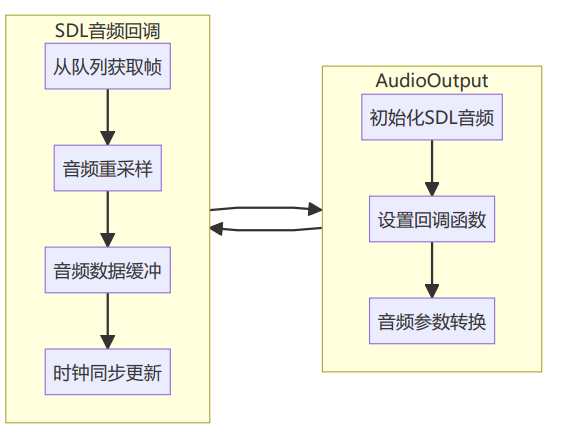

## 音频输出设计
声音输出模块负责从帧队列获取音频帧，进行必要的重采样，并通过SDL输出音频。

## 音频输出原理
1. **初始化流程**：
。初始化`SDL音频子系统`
。设置`音频参数`(`采样率、通道数、格式`)
。设置音频`回调函数`
。创建`重采样上下文`(如需要)
2. **回调机制**：
。SDL音频系统在需要数据时调用设置的回调函数
。回调函数从帧队列获取音频帧
。根据需要进行重采样(使用`SwrContext`)
。将处理后的`音频数据填充到SDL提供的缓冲区`
3. **音频时钟**：
。以`音频PTS`作为`主时钟`
。在`每次回调中更新音频时钟`
。作为视频同步的基准
4. **资源管理**：
。管理`重采样上下文`(SwrContext)
。管理`音频缓冲区`
。在`Delnit`和析构函数中释放资源