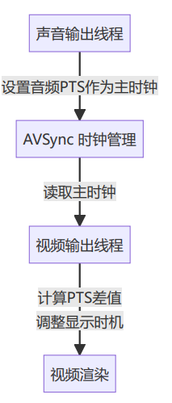

## 音视频同步

## 同步原理
1. **主时钟选择**：
。使用`音频PTS`作为`主时钟`基准
。音频在`回调函数`中更新时钟值
2. **视频同步策略**：
。计算`视频帧PTS与当前音频时钟`的差值
。差值为正(视频超前)：延迟显示
。差值为负(视频滞后)：立即显示
。差值过大：考虑跳顿或重复帧
3. **时钟管理**：
。`AVSync`类提供时钟读写接口
。音频线程设置时钟
。视频线程读取时钟