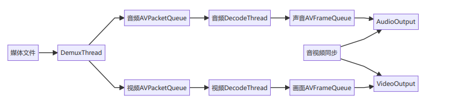

## 数据流向
播放器中的数据从媒体文件读取，经过多个处理阶段，最终输出到显示设备。

## 数据流说明
1. **解复用阶段**：
。`DemuxThread`读取媒体文件
。分离音视频数据包
。将音视频包放入对应的`AVPacketQueue`
2. **解码阶段**：
。`DecodeThread`从`AVPacketQueue`获取数据包
。使用`FFmpeg`解码器`解码`数据包
。生成音视频帧并放入`AVFrameQueue`
3. **渲染阶段**：
。`AudioOutput/VideoOutput`从`AVFrameQueue`获取帧
。处理帧数据(重采样、格式转换等)
。通过SDL渲染到输出设备