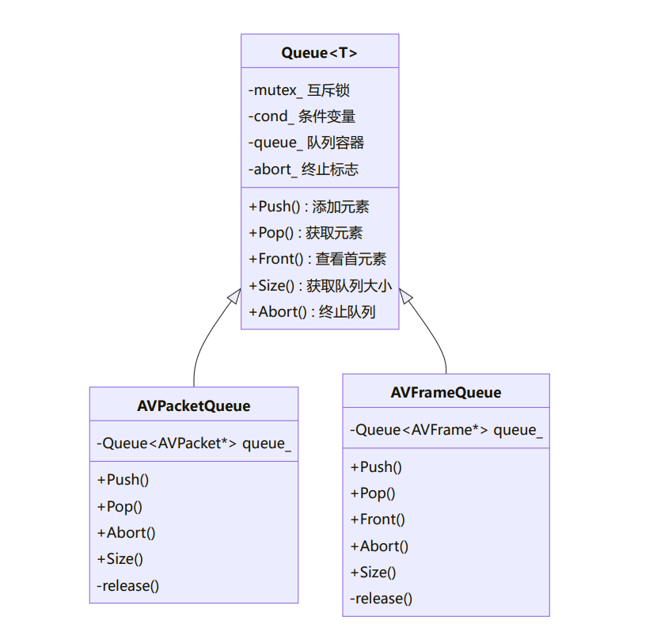

## 队列式设计
队列是连接各处理阶段的关键组件，负责**数据缓冲和线程间通信**。

## 队列设计原理
1. **模板设计**：使用`C++模板`实现通用队列结构，提高代码复用率
2. **线程安全**：使用`互斥锁和条件变量`保证多线程环境下的数据一致性
3. **特化实现**：为`AVPacket`和`AVFrame`提供特化队列，处理`FFmpeg`资源的引用计数
4. **终止机制**：通过`abort`标志控制队列终止，实现`优雅退出`
5. **资源管理**：
`AVPacketQueue`负责管理`AVPacket`资源，使用`av_packet_free`释放
`oAVFrameQueue`负责管理`AVFrame`资源，使用`av_frame_free`释放