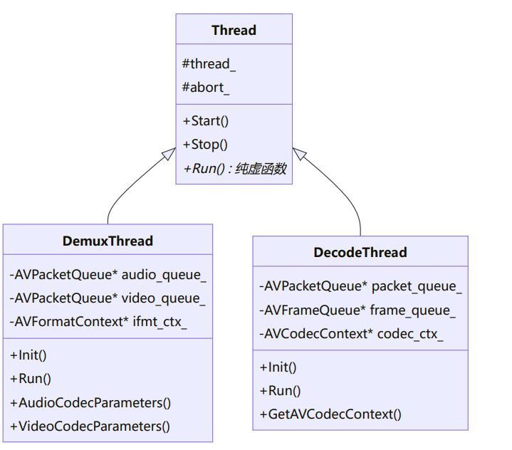

## 线程设计
播放器采用多线程架构，通过基类`Thread`实现**通用线程控制,派生类实现具体功能。**

## 线程设计原理
1. **基类封装**：`Thread`基类封装线程`创建`、`启动`和`停止`的通用逻辑
2. **虚函数机制**：通过`纯虚函数Run()`要求派生类实现具体业务逻辑
3. **状态控制**：使用`abort_`标志控制线程循环状态，实现`优雅退出`
4. **资源管理**：
`oDemuxThread`管理文`件读取和格式解析资源`(`AVFormatContext`)
`oDecodeThread`管理`解码器资源`(`AVCodecContext`)
5. **线程协作**：**通过队列实现线程间数据传递**，解耦**生产者和消费者** 