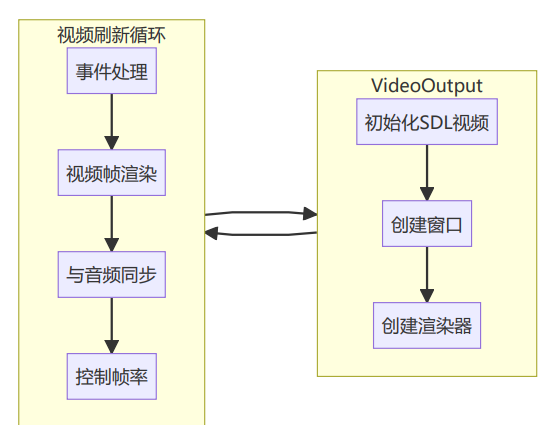

## 视频输出设计
画面输出模块负责从帧队列获取视频帧，与音频同步，并通过SDL渲染到屏幕。

## 视频输出原理
1. **初始化流程**：
。初始化`SDL视频子系统`
。创建`窗口`和`渲染器`
。创建`纹理`用于视频`渲染`
2. **主循环机制**：
。处理`SDL事件(如退出、按键等)`
。`刷新` `视频帧`
。控制`帧率`以实现音视频同步
3. **同步策略**：
。比较视`频帧PTS与音频时钟`
。如果视频超前，等待适当时间再显示
。如果视频滞后，立即显示并可能丢帧
4. **渲染过程**：
。将YUV数据更新到SDL纹理
。将纹理渲染到窗口
。释放已显示的帧
5. **资源管理**：
。管理`SDL资源`(窗口、渲染器、纹理)
。在Delnit和析构函数中释放资源