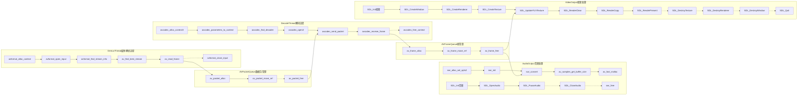

```mermaid
graph LR
    subgraph "DemuxThread媒体解析流程"
        A1[avformat_alloc_context]-->A2[avformat_open_input]
        A2-->A3[avformat_find_stream_info]
        A3-->A4[av_find_best_stream]
        A4-->A5[av_read_frame]
        A5-.->A6[avformat_close_input]
    end
    
    subgraph "DecodeThread解码流程"
        B1[avcodec_alloc_context3]-->B2[avcodec_parameters_to_context]
        B2-->B3[avcodec_find_decoder]
        B3-->B4[avcodec_open2]
        B4-->B5[avcodec_send_packet]
        B5-->B6[avcodec_receive_frame]
        B6-.->B7[avcodec_free_context]
    end
    
    subgraph "AVPacketQueue数据包管理"
        C1[av_packet_alloc]-->C2[av_packet_move_ref]
        C2-.->C3[av_packet_free]
    end
    
    subgraph "AVFrameQueue帧管理"
        D1[av_frame_alloc]-->D2[av_frame_move_ref]
        D2-.->D3[av_frame_free]
    end
    
    subgraph "AudioOutput音频处理"
        E1[swr_alloc_set_opts2]-->E2[swr_init]
        E2-->E3[swr_convert]
        E3-->E4[av_samples_get_buffer_size]
        E4-->E5[av_fast_malloc]
        E6[SDL_Init音频]-->E7[SDL_OpenAudio]
        E7-->E8[SDL_PauseAudio]
        E8-.->E9[SDL_CloseAudio]
        E9-.->E10[swr_free]
    end
    
    subgraph "VideoOutput视频处理"
        F1[SDL_Init视频]-->F2[SDL_CreateWindow]
        F2-->F3[SDL_CreateRenderer]
        F3-->F4[SDL_CreateTexture]
        F4-->F5[SDL_UpdateYUVTexture]
        F5-->F6[SDL_RenderClear]
        F6-->F7[SDL_RenderCopy]
        F7-->F8[SDL_RenderPresent]
        F8-.->F9[SDL_DestroyTexture]
        F9-.->F10[SDL_DestroyRenderer]
        F10-.->F11[SDL_DestroyWindow]
        F11-.->F12[SDL_Quit]
    end
    
    %% 模块间主要数据流
    A5-->C1
    C3-->B5
    B6-->D1
    D3-->E3
    D3-->F5
``` 